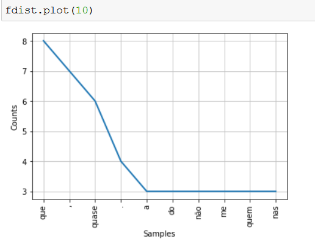

# Sistemas Multimídia - IFMA
Repositório de Processamento de Linguagem Natural

## Introdução

Nesses scripts usamos o scikit-image, opencv e outras bibliotecas.

### Pre requisitos

Instalar e configurar o Anaconda que já vem com o interpretador Python.

### Outros repositórios (PLN)

- APPNLUWatson: Aplicação web de Análise de Sentimentos.
https://github.com/rcbmdev/AppNLUWatson

### Orientações

Os scripts utilizam a IDE Jupyter Notebook e podem ser executadas com o comando jupyter notebook via terminal.

Segue uma demonstração de um script:

